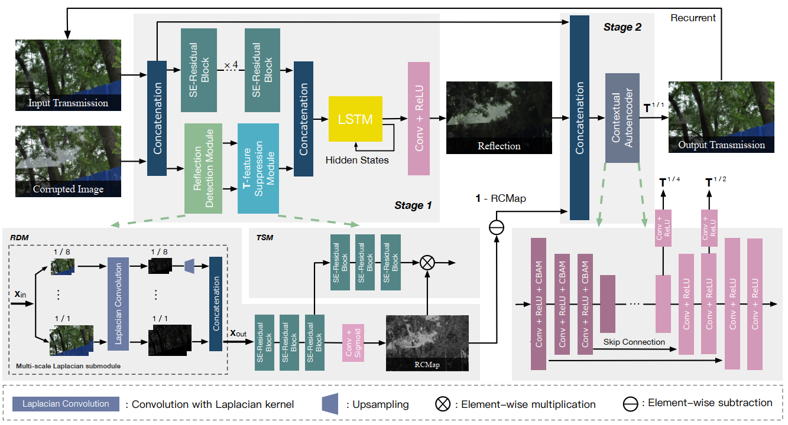

<!--
 * @Author: your name
 * @Date: 2021-09-09 15:18:34
 * @LastEditTime: 2021-09-10 09:32:54
 * @LastEditors: Please set LastEditors
 * @Description: In User Settings Edit
 * @FilePath: \prometheus\algorithm\pytorch\image_inpainting\Location-aware Single Image Reflection Removal.md
-->

### Location-aware Single Image Reflection Removal

使用多尺度的拉普拉斯特征图判断属于`reflection`的置信度

根据指导的置信度，使用递归网络逐步细化`reflection removal  `结果

注：在`强阴影`情况下，效果好于`SOTA`

