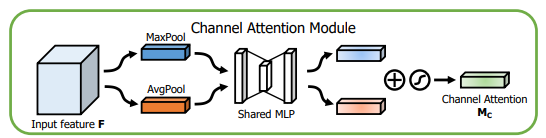

<!--
 * @Author: your name
 * @Date: 2021-09-08 10:15:59
 * @LastEditTime: 2021-09-08 14:24:01
 * @LastEditors: Please set LastEditors
 * @Description: In User Settings Edit
 * @FilePath: \deflare_algorithm\attention\README.md
-->
## SENet

作者的动机是希望显式地建模特征通道之间的相互依赖关系。另外，作者并未引入新的空间维度来进行特征通道间的融合，而是采用了一种全新的「特征重标定」策略。具体来说，就是通过学习的方式来自动获取到每个特征通道的重要程度，然后依照这个重要程度去提升有用的特征并抑制对当前任务用处不大的特征。通俗的来说`SENet`的核心思想在于通过网络根据`loss`去学习特征权重，使得有效的`feature map`权重大，无效或效果小的`feature map`权重小的方式训练模型达到更好的结果。`SE block`嵌在原有的一些分类网络中不可避免地增加了一些参数和计算量，但是在效果面前还是可以接受的。`Sequeeze-and-Excitation(SE) block`并不是一个完整的网络结构，而是一个子结构，可以嵌到其他分类或检测模型中。

注：`F_sq`代表`Squeeze`操作，`F_ex`代表`Excitation`操作，`F_scale`代表`Scale`操作。

`SE Block`结构如下图所示：输入`X`经过任意变换之后变为输出`U`，假设输出的`U`不是最优的，每个通道的重要程度不同，有的通道更有用，有的通道不太有用。因此对于每一个输出通道，先进行`global average pooling`，每个通道得到一个标量，`C`个通道得到`C`个数，然后经过`FC-ReLU-FC-Sigmoid`得到`C`个0到1之间的标量，作为通道的权重。最后对原来输出通道的每个通道用对应的权重加权（对应通道的每个元素与权重分别相乘），得到新的加权后的特征图，作者称之为`feature recalibration`。

### Squeeze

由于卷积只是在一个局部空间内进行操作，`U`很难获得足够的信息来提取`channel`之间的关系，对于网络中前面的层这更严重，因为感受野比较小。`Squeeze`操作将一个`channel`上整个空间特征编码为一个全局特征，采用`global average pooling`来实现（原则上也可以采用更复杂的聚合策略）。

### Excitation

`Squeeze`操作得到了全局描述特征，接下来需要另一种运算来抓取`channel`之间的关系，这个操作需要满足两个原则：首先要灵活，它要可以学习到各个`channel`之间的非线性关系；第二点是学习的关系不是互斥的，因为这里允许多`channel`的特征，而不是`one-hot`形式。基于此，这里采用`sigmoid`形式的`gating`机制。

### Scale

`Scale`操作是将学习到的各个`channel`的激活值（`sigmoid`激活，值为0到1）乘以`U`上的原始特征。

### 嵌入其他结构

### 结论

`SE Block`首先对卷积得到的特征图进行`Squeeze`操作，得到`channel`级的全局特征，然后对全局特征进行`Excitation`操作，学习各个`channel`间的关系，得到不同`channel`的权重。最后进行`Scale`操作，即将得到的不同`channel`的权重乘以原来的特征图得到最终特征。本质上，`SE Block`是在`channel`维度上做`attention`或者`gating`操作。这种注意力机制让模型可以更加关注信息量最大的`channel`特征，而抑制那些不重要的`channel`特征。另外一点是`SE Block`是通用的，这意味着其可以嵌入到现有的网络框架中。

### reference

[ 【注意力机制】SENet详解  [姚路遥遥] CSDN ](https://blog.csdn.net/Roaddd/article/details/111357490)

## CBAM

`CBAM` 包含2个独立的子模块， `通道注意力模块`（Channel Attention Module，CAM) 和`空间注意力模块`（Spartial Attention Module，SAM) ，分别进行通道与空间上的 `Attention`。 这样不只能够节约参数和计算力，并且保证了其能够做为即插即用的模块集成到现有的网络架构中去。

### CAM

将输入的特征图F（`H×W×C`）分别经过基于`width`和`height`的`global max pooling`（全局最大池化）和`global average pooling`（全局平均池化），得到两个`1×1×C`的特征图，接着，再将它们分别送入一个两层的神经网络（`MLP`），第一层神经元个数为 `C/r`（r为减少率），激活函数为 `Relu`，第二层神经元个数为 `C`，这个两层的神经网络是共享的。而后，将`MLP`输出的特征进行基于`element-wise`的加和操作，再经过`sigmoid`激活操作，生成最终的`channel attention feature`，即`M_c`。最后，将`M_c`和输入特征图F做`element-wise`乘法操作，生成`Spatial attention`模块需要的输入特征。

#### pooling方式

在`channel attention`中，`avg&&max`的并行池化的效果要更好。这里也有可能是池化丢失的信息太多，`avg&&max`的并行连接方式比单一的池化丢失的信息更少，所以效果会更好一点。

### SAM

将`Channel attention`模块输出的特征图`F'`作为本模块的输入特征图。首先做一个基于`channel`的`global max pooling` 和`global average pooling`，得到两个`H×W×1` 的特征图，然后将这2个特征图基于`channel`做`concat`操作（通道拼接）。然后经过一个7×7卷积（7×7比3×3效果要好）操作，降维为1个`channel`，即`H×W×1`。再经过`sigmoid`生成`spatial attention feature`，即`M_s`。最后将该`feature`和该模块的输入`feature`做乘法，得到最终生成的特征。

### 组合顺序

通道注意力和空间注意力这两个模块能够以并行或者串行顺序的方式组合在一块儿，经过实验，先通道再空间效果会好一点。

### 与Resnet组合

直接加在卷积之后的`featuremap`之后。

### 结论

论文提出了一种基于注意力机制的轻量型结构 `CBAM` ，基本上可以添加到所有常规的卷积层中。验证了 `Channel Attention Module` 中 `avg&&max` 并行的方式最好，接下来通过实验验证了`Channel Attention Module` 和 `Spatial Attention Module` 的最佳先后顺序，还对比了 `CBAM` 与 `SENet` 的性能。文章还可视化了 `CBAM` 的关注区域，使得 `CBAM` 具有更好的解释性。最后在目标检测任务上进行实验，验证了 `CBAM` 的通用性好。

### reference

[ 【注意力机制】CBAM详解  [姚路遥遥] CSDN ](https://blog.csdn.net/Roaddd/article/details/114646354)

